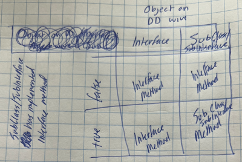

# Interfaces (General)

**Should one check `Descendants must override`?** 
By default, the checkbox is checked. If one unchecks it, it just means that when the interface method is executed (with a concrete implementation on the wire), if the concrete implementation does not implement the method (since the checkbox is not checked), then the interface method is executed. 
In this case, where the checkbox is not checked, the interface method is executed. By default, the method is abstract. Though, one can put implementation in here. This means that all concrete implementations that do not implement this method will execute this interface method.. This is beneficial when the default behavior between concrete objects must share the same behavior. 
This is not an excuse to use concrete implementations here. Still use interface methods and any additional behavior not tied to concrete implementations.
> Application: interfaces tied to messages have the checkbox unchecked as the messages are protected scope.

## LVCAM Interfaces

 
*Interfaces changed to NOT override in ALL of DD methods and set to `Shared Clone`.*

# Procedure

- make recieve and the other one with inputs and **OUTPUT** object

- Change `MsgToNested` to have icon be two lines i.e. `MsgTo` and `Nested`. chnage for all, including decorators in Dev Actor. 
 
*but have on two lines, with decorator on third line.*

# Solved!

Problem: Need map for Nest Actors instead of set, to get the name?
How does Send to Nest work? How to find alias inside? I don’t remember, maybe you don’t need to have map..?

 
*Solution: NO! The queue has the name set when it was obtained.*

# Nathan Decisions

## Dynamic Dispatch (DD)

Everything is DD, declaring to the compiler that *objects* input are the same *objects* being output. If the DD method is not used in a Subclass/SubInterface, don’t implement the method.

## Abandoning Datatype IO Serialization

An indication that the data in the datatype will *potentially* be manipulated is when a datatype is being passed in and out through a method. Unless an datatype can be manipulated in an Interface/Subclass/Subinterface, then the datatype should not have an output.

If a method must be serialized, embrace the flat sequence structure / error case structure. DO NOT pass a datatype from the input to the output of the method for the *sole purpose* of serialization. Understand that other developers will not know your intent and will assume that the data in the datatype will *potentially* be manipulated.

### Error Serialization

The traditional error input is not allowed.

Do not serialize by using an error cluster input and output. This provides difficulty for readability since the developer does not know if the error is being manipulated by the method.

## Interface Method Determination

 
*Determination of either Interface Method or Subclass/Subinterface Method call given the object passed to the DD wire and if the Subclass/Subinterface has implemented the interface method.*

## Class and Interface Definition

Container capable of housing.. 
**Class:** ..data AND methods. (two check boxes don't matter since no inheritance allowed) 
**Interface:** ..methods. (Default: unchecked) (doesn't necessarily mean abstraction)

## Package Best Practices

Reuse code between libraries occurs **only** by relation (implementation/association/dependency/composition/aggregation) to interfaces.

## All Classes/Interfaces contained in library

## Icons

- Shows Interface / Class name.
- color of banner indicates if a library/interface/class container.
- Text of method name
- color of method name indicates access scope of method/control.

## Accessor Methods

Only contains either the unbundle or bundle operation.

Never use property node syntax with accessor methods. Use the accessor methods as they're more descriptive, adhering to the rules in this writing.

~~Private~~: Do not make sense since the data is already private to the class. 
~~Public~~: Encapsulation is of upmost importance. Other class objects should not have ability to read/write this data type. 
Proteted: If an interface already knows the concrete classes will contain that private data. 
Community: State Pattern.. only other objects that are friends.

## Wrapper Methods

Wrapping interface method with unbundle and bundle operation. Green outline of banner and method shows, the only operation that occurs internally is the unbundle, interface method, bundle

## Community Scope

Friends can ONLY be with class/interfaces within the same library. Promotes decoupling between libraries. This can change.

## Private data

If private data is to be accessed within the class that owns the data, always use unbundle/bundle. Do not use accessors.

## Naming Convention

Captial letters. Spaces.

## Message methods are protected

Only the actor can execute the method, or other classes/interfaces that implement this interface containing the protected method.

##  Message Methods

Payload Methods -> Message Methods

Get rid of Actor_blahblah, just keep blahblah

LVCAM.lvlib
-Create.lvlib
-Last Ack.lvlib
-Destroy.lvlib
-EverythingElse

Rename folders on disc later.. not important now

Look into interfaces (don’t override DD methods) messages done in