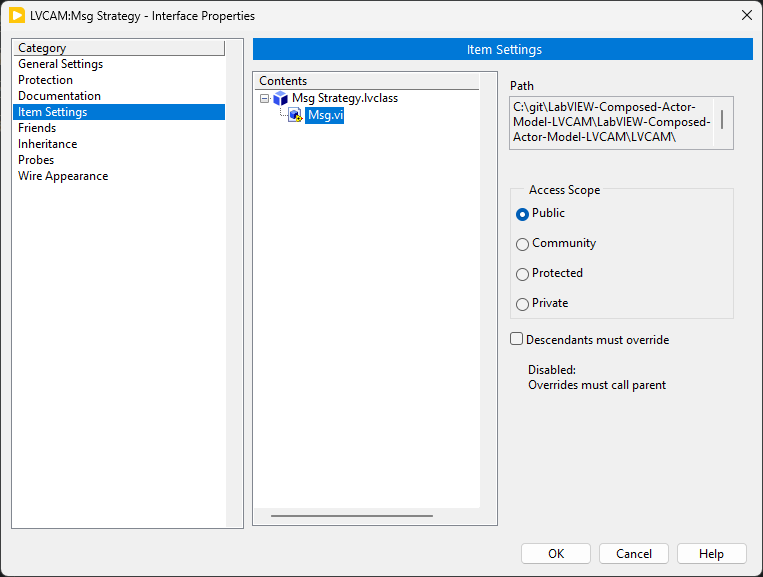
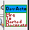
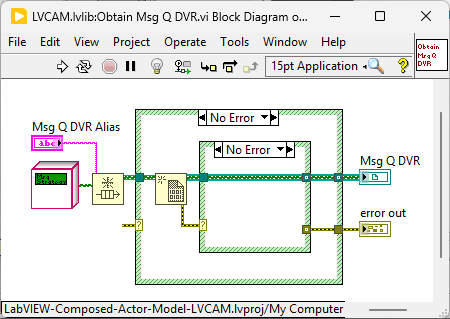

# Interfaces (General)

**Should one check `Descendants must override`?** 
By default, the checkbox is checked. If one unchecks it, it just means that when the interface method is executed (with a concrete implementation on the wire), if the concrete implementation does not implement the method (since the checkbox is not checked), then the interface method is executed. 
In this case, where the checkbox is not checked, the interface method is executed. By default, the method is abstract. Though, one can put implementation in here. This means that all concrete implementations that do not implement this method will execute this interface method.. This is beneficial when the default behavior between concrete objects must share the same behavior. 
This is not an excuse to use concrete implementations here. Still use interface methods and any additional behavior not tied to concrete implementations.
> Application: interfaces tied to messages have the checkbox unchecked as the messages are protected scope.

## LVCAM Interfaces

 
*Interfaces changed to NOT override in ALL of DD methods and set to `Shared Clone`.*

# Procedure

- make recieve and the other one with inputs and **OUTPUT** object

- Change `MsgToNested` to have icon be two lines i.e. `MsgTo` and `Nested`. chnage for all, including decorators in Dev Actor. 
 
*but have on two lines, with decorator on third line.*

# Solved!

Problem: Need map for Nest Actors instead of set, to get the name?
How does Send to Nest work? How to find alias inside? I don’t remember, maybe you don’t need to have map..?

 
*Solution: NO! The queue has the name set when it was obtained.*